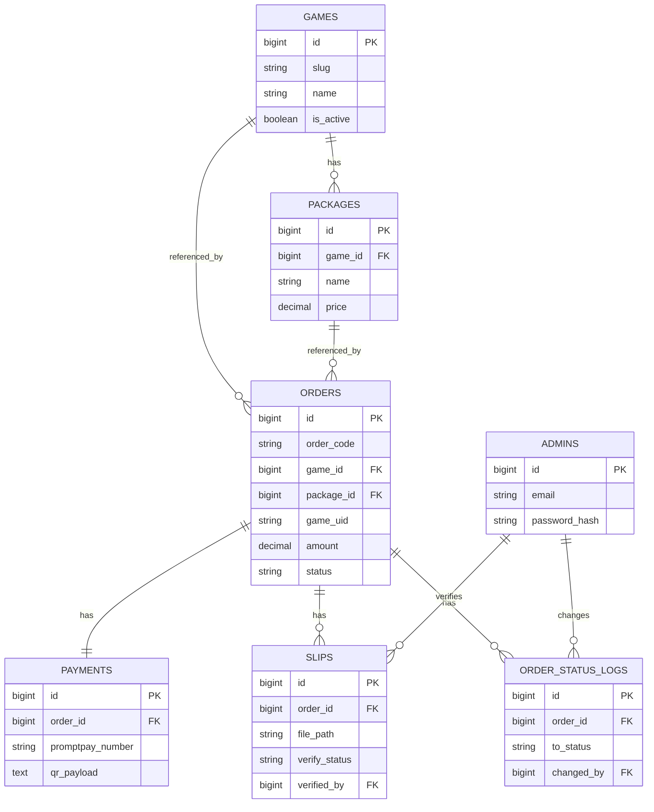

# Bentopup — System Architecture Document

ระบบเติมเกมออนไลน์ (Production Ready)
Stack: Next.js 15 + TypeScript + Tailwind + Shadcn UI | Express.js | MySQL 8 | Docker

---

## 1. System Architecture

```
                         ┌─────────────────────────┐
                         │        Customer          │
                         └───────────┬──────────────┘
                                     │ HTTPS
                         ┌───────────▼──────────────┐
                         │   Frontend (Next.js 15)   │
                         │   - App Router            │
                         │   - Server Components     │
                         │   - Tailwind + Shadcn UI  │
                         └───────────┬──────────────┘
                                     │ REST API (JSON) /api/*
                         ┌───────────▼──────────────┐
                         │  Backend (Express.js)     │
                         │  - REST API               │
                         │  - JWT Auth (Admin)       │
                         │  - PromptPay QR Generator │
                         │  - File Upload (Slip)     │
                         └───────┬───────────┬───────┘
                                 │           │
                    ┌────────────▼─┐   ┌─────▼──────────┐
                    │   MySQL 8     │   │  Volume:        │
                    │   (Data)      │   │  /uploads        │
                    │               │   │  (slips, games)  │
                    └───────────────┘   └─────────────────┘

                         ┌───────────────────────────┐
                         │  phpMyAdmin (internal only) │
                         └───────────────────────────┘
```

**หลักการออกแบบ**

- Frontend และ Backend แยกกันชัดเจน (decoupled), คุยกันผ่าน REST API เท่านั้น
- Backend เป็น Single Source of Truth ของ Business Logic ทั้งหมด (สถานะออเดอร์, การตรวจสลิป, การคำนวณยอดขาย)
- ไฟล์ที่อัปโหลด (สลิป, thumbnail, banner เกม) เก็บใน Docker Volume แยกจาก container เพื่อไม่ให้หายเวลา rebuild
- PromptPay QR ถูก generate แบบ dynamic จากเบอร์โทร + ยอดเงิน ทุกครั้งที่สร้างออเดอร์ (ไม่ generate ล่วงหน้า เพราะยอดเงินเปลี่ยนตามแพ็กเกจ)
- JWT ใช้เฉพาะฝั่ง Admin เท่านั้น ฝั่งลูกค้าไม่ต้อง login แต่ใช้ Order Code + เบอร์/UID ในการตรวจสอบสถานะ

---

## 2. Folder Structure

```
bentopup/
├── docker-compose.yml
├── .env.example
├── README.md
│
├── frontend/
│   ├── Dockerfile
│   ├── package.json
│   ├── next.config.ts
│   ├── tailwind.config.ts
│   ├── src/
│   │   ├── app/
│   │   │   ├── (storefront)/
│   │   │   │   ├── page.tsx                 # หน้าเลือกเกม
│   │   │   │   ├── games/[slug]/page.tsx     # เลือกแพ็กเกจ + กรอก UID
│   │   │   │   ├── checkout/[orderCode]/page.tsx  # ชำระเงิน + อัปโหลดสลิป
│   │   │   │   └── track/page.tsx            # ตรวจสอบสถานะออเดอร์
│   │   │   ├── admin/
│   │   │   │   ├── login/page.tsx
│   │   │   │   ├── dashboard/page.tsx
│   │   │   │   ├── orders/page.tsx
│   │   │   │   ├── orders/[id]/page.tsx
│   │   │   │   ├── games/page.tsx
│   │   │   │   ├── games/[id]/page.tsx
│   │   │   │   ├── packages/page.tsx
│   │   │   │   └── settings/page.tsx
│   │   │   └── layout.tsx
│   │   ├── components/
│   │   │   ├── ui/                          # shadcn components
│   │   │   ├── storefront/
│   │   │   └── admin/
│   │   ├── lib/
│   │   │   ├── api-client.ts                # fetch wrapper เรียก backend
│   │   │   └── utils.ts
│   │   ├── hooks/
│   │   └── types/
│   └── public/
│
├── backend/
│   ├── Dockerfile
│   ├── package.json
│   ├── tsconfig.json
│   ├── src/
│   │   ├── index.ts
│   │   ├── config/
│   │   │   ├── db.ts
│   │   │   └── env.ts
│   │   ├── modules/
│   │   │   ├── auth/        (controller, service, routes)
│   │   │   ├── games/
│   │   │   ├── packages/
│   │   │   ├── orders/
│   │   │   ├── payments/
│   │   │   ├── slips/
│   │   │   ├── settings/
│   │   │   └── dashboard/
│   │   ├── middlewares/
│   │   │   ├── auth.middleware.ts
│   │   │   ├── error.middleware.ts
│   │   │   └── upload.middleware.ts          # multer config
│   │   ├── utils/
│   │   │   ├── promptpay.ts                  # gen QR payload
│   │   │   ├── orderCode.ts
│   │   │   └── logger.ts
│   │   └── database/
│   │       ├── migrations/
│   │       └── seeds/
│   └── uploads/
│       ├── slips/
│       ├── games/thumbnails/
│       └── games/banners/
│
└── docker/
    └── mysql/
        └── init/                              # optional init scripts
```

---

## 3. Database Design

**ตาราง: admins**
| Field | Type | หมายเหตุ |
|---|---|---|
| id | BIGINT PK AI | |
| email | VARCHAR(255) UNIQUE | |
| password_hash | VARCHAR(255) | bcrypt |
| name | VARCHAR(255) | |
| created_at / updated_at | TIMESTAMP | |

**ตาราง: games**
| Field | Type | หมายเหตุ |
|---|---|---|
| id | BIGINT PK AI | |
| slug | VARCHAR(255) UNIQUE | ใช้ใน URL |
| name | VARCHAR(255) | |
| description | TEXT NULL | |
| thumbnail_url | VARCHAR(500) NULL | |
| banner_url | VARCHAR(500) NULL | |
| uid_label | VARCHAR(100) | เช่น "User ID", "Player ID + Server" |
| is_active | BOOLEAN DEFAULT true | เปิด/ปิดเกม |
| sort_order | INT DEFAULT 0 | |
| created_at / updated_at | TIMESTAMP | |

**ตาราง: packages**
| Field | Type | หมายเหตุ |
|---|---|---|
| id | BIGINT PK AI | |
| game_id | BIGINT FK → games.id | |
| name | VARCHAR(255) | เช่น "60 เพชร" |
| price | DECIMAL(10,2) | |
| is_active | BOOLEAN DEFAULT true | |
| sort_order | INT DEFAULT 0 | |
| created_at / updated_at | TIMESTAMP | |

**ตาราง: orders**
| Field | Type | หมายเหตุ |
|---|---|---|
| id | BIGINT PK AI | |
| order_code | VARCHAR(20) UNIQUE | เช่น BTU-20260620-0001 |
| game_id | BIGINT FK → games.id | |
| package_id | BIGINT FK → packages.id | |
| game_uid | VARCHAR(255) | UID ที่ลูกค้ากรอก |
| contact | VARCHAR(255) NULL | เบอร์/ไลน์ ลูกค้า (optional) |
| amount | DECIMAL(10,2) | snapshot ราคา ณ เวลาสั่งซื้อ |
| status | ENUM(...) | WAITING_PAYMENT, WAITING_VERIFY, PROCESSING, COMPLETED, CANCELLED |
| created_at / updated_at | TIMESTAMP | |

**ตาราง: payments**
| Field | Type | หมายเหตุ |
|---|---|---|
| id | BIGINT PK AI | |
| order_id | BIGINT FK → orders.id | |
| method | VARCHAR(50) DEFAULT 'promptpay' | |
| promptpay_number | VARCHAR(20) | snapshot เบอร์ ณ เวลานั้น |
| qr_payload | TEXT | string ที่ใช้ gen QR |
| created_at | TIMESTAMP | |

**ตาราง: slips**
| Field | Type | หมายเหตุ |
|---|---|---|
| id | BIGINT PK AI | |
| order_id | BIGINT FK → orders.id | |
| file_path | VARCHAR(500) | |
| uploaded_at | TIMESTAMP | |
| verified_by | BIGINT FK → admins.id NULL | |
| verified_at | TIMESTAMP NULL | |
| verify_status | ENUM('PENDING','APPROVED','REJECTED') DEFAULT 'PENDING' | |
| reject_reason | VARCHAR(500) NULL | |

**ตาราง: settings** (key-value)
| Field | Type | หมายเหตุ |
|---|---|---|
| id | BIGINT PK AI | |
| key | VARCHAR(100) UNIQUE | เช่น promptpay_number, shop_name |
| value | TEXT | |
| updated_at | TIMESTAMP | |

**ตาราง: order_status_logs**
| Field | Type | หมายเหตุ |
|---|---|---|
| id | BIGINT PK AI | |
| order_id | BIGINT FK → orders.id | |
| from_status | VARCHAR(50) NULL | |
| to_status | VARCHAR(50) | |
| changed_by | BIGINT FK → admins.id NULL | |
| note | VARCHAR(500) NULL | |
| created_at | TIMESTAMP | |

**Indexes ที่จะสร้าง**
- `orders(order_code)` unique, `orders(status)`, `orders(game_id)`, `orders(created_at)`
- `packages(game_id)`, `games(slug)` unique, `games(is_active)`
- `slips(order_id)`, `payments(order_id)`
- `order_status_logs(order_id)`

**Foreign Keys**
- `packages.game_id → games.id` (ON DELETE RESTRICT — ป้องกันลบเกมที่มีแพ็กเกจอยู่)
- `orders.game_id → games.id`, `orders.package_id → packages.id` (RESTRICT)
- `payments.order_id → orders.id` (CASCADE)
- `slips.order_id → orders.id` (CASCADE), `slips.verified_by → admins.id` (SET NULL)
- `order_status_logs.order_id → orders.id` (CASCADE), `changed_by → admins.id` (SET NULL)

---

## 4. ER Diagram



---

## 5. API Design

### Public API (ไม่ต้อง Auth)

| Method | Endpoint | คำอธิบาย |
|---|---|---|
| GET | `/api/games` | รายชื่อเกมที่ is_active=true |
| GET | `/api/games/:slug` | รายละเอียดเกม + แพ็กเกจที่ active |
| POST | `/api/orders` | สร้างออเดอร์ (game_id, package_id, game_uid, contact) → คืน order_code + qr |
| GET | `/api/orders/:orderCode` | ดูรายละเอียด/สถานะออเดอร์ |
| POST | `/api/orders/:orderCode/slip` | อัปโหลดสลิป (multipart/form-data) |

### Admin API (ต้อง JWT)

| Method | Endpoint | คำอธิบาย |
|---|---|---|
| POST | `/api/admin/auth/login` | login ด้วย email/password → JWT |
| GET | `/api/admin/auth/me` | ข้อมูล admin ปัจจุบัน |
| GET | `/api/admin/dashboard/summary` | ยอดขายวันนี้/เดือนนี้/ทั้งหมด, จำนวนออเดอร์ |
| GET | `/api/admin/dashboard/chart` | ข้อมูลกราฟยอดขาย (รายวัน/รายเดือน) |
| GET | `/api/admin/orders` | list + filter (status, game, date, search by order_code/uid) |
| GET | `/api/admin/orders/:id` | รายละเอียดออเดอร์ + สลิป + log |
| PATCH | `/api/admin/orders/:id/status` | เปลี่ยนสถานะ (เขียน log อัตโนมัติ) |
| GET | `/api/admin/games` | list เกมทั้งหมด (รวม inactive) |
| POST | `/api/admin/games` | เพิ่มเกม (รองรับอัปโหลด thumbnail/banner) |
| PUT | `/api/admin/games/:id` | แก้ไขเกม |
| DELETE | `/api/admin/games/:id` | ลบเกม |
| PATCH | `/api/admin/games/:id/toggle` | เปิด/ปิดเกม |
| GET | `/api/admin/games/:id/packages` | list แพ็กเกจของเกม |
| POST | `/api/admin/packages` | เพิ่มแพ็กเกจ |
| PUT | `/api/admin/packages/:id` | แก้ไขแพ็กเกจ |
| DELETE | `/api/admin/packages/:id` | ลบแพ็กเกจ |
| GET | `/api/admin/settings` | ดูค่า settings ทั้งหมด |
| PUT | `/api/admin/settings/promptpay` | เปลี่ยนเบอร์ PromptPay |

**มาตรฐาน Response**
```json
{ "success": true, "data": {...} }
{ "success": false, "error": { "code": "ORDER_NOT_FOUND", "message": "..." } }
```

---

## 6. User Flow (ลูกค้า)

1. เข้าหน้าแรก → เห็นรายการเกมที่เปิดใช้งาน (จาก `/api/games`)
2. เลือกเกม → เห็นรายละเอียดเกม + แพ็กเกจทั้งหมด
3. เลือกแพ็กเกจ → กรอก UID ตาม `uid_label` ของเกมนั้น
4. กด "สั่งซื้อ" → ระบบสร้าง order (`status=WAITING_PAYMENT`) + คำนวณยอด + gen QR PromptPay
5. หน้า Checkout แสดง QR + ยอดเงิน + เลขออเดอร์
6. ลูกค้าโอนเงิน → อัปโหลดสลิป → `status=WAITING_VERIFY`
7. แอดมินตรวจสลิป → อนุมัติ → `status=PROCESSING` → เติมเกมเสร็จ → `status=COMPLETED`
   (ถ้าสลิปผิด/ปลอม → `status=CANCELLED` พร้อมเหตุผล)
8. ลูกค้าใช้ order_code ตรวจสอบสถานะได้ที่หน้า Track ตลอดเวลา

## 7. Admin Flow

1. Login ด้วย email/password (จาก ENV ตอน seed ครั้งแรก) → ได้ JWT
2. **Dashboard**: ดูยอดขายวันนี้/เดือนนี้/ทั้งหมด, จำนวนออเดอร์แยกตามสถานะ, กราฟยอดขาย
3. **Order Management**: ดู list ออเดอร์ → กรองตามสถานะ/เกม/วันที่ → เปิดดูรายละเอียด+สลิป → อนุมัติ/ปฏิเสธ → ระบบเขียน `order_status_logs` อัตโนมัติทุกครั้งที่เปลี่ยนสถานะ
4. **Game Management**: เพิ่ม/แก้ไข/ลบ/เปิดปิดเกม, อัปโหลด thumbnail & banner
5. **Package Management**: เพิ่ม/แก้ไข/ลบแพ็กเกจ ผูกกับเกม
6. **Settings**: เปลี่ยนเบอร์ PromptPay (เก็บใน `settings` table, ระบบ gen QR ใหม่จากเบอร์นี้ทุกครั้งที่มีออเดอร์ใหม่)

---

## หมายเหตุด้านเทคนิคที่จะใช้จริง (ไม่ใช่ Mock/Placeholder)

- **QR PromptPay**: ใช้ไลบรารี `promptpay-qr` สร้าง payload ตามมาตรฐาน EMVCo จากเบอร์โทร + ยอดเงิน แล้ว encode เป็นภาพด้วย `qrcode`
- **Upload**: ใช้ `multer` เก็บไฟล์ลง volume `/uploads` จริง, validate type/size (jpg, png, pdf ≤ 5MB)
- **Auth**: JWT (access token) + bcrypt สำหรับ password, middleware ตรวจสอบทุก route `/api/admin/*`
- **Migration**: ใช้ raw SQL migration files (เรียงเลขลำดับ) รันอัตโนมัติตอน backend start หรือผ่าน script แยก
- **Order code**: generate แบบ `BTU-YYYYMMDD-XXXX` กัน race condition ด้วย transaction + unique constraint

---

รอการอนุมัติ Architecture นี้ก่อนเริ่มเขียนโค้ดส่วนแรก (ตามที่กำหนดไว้)
